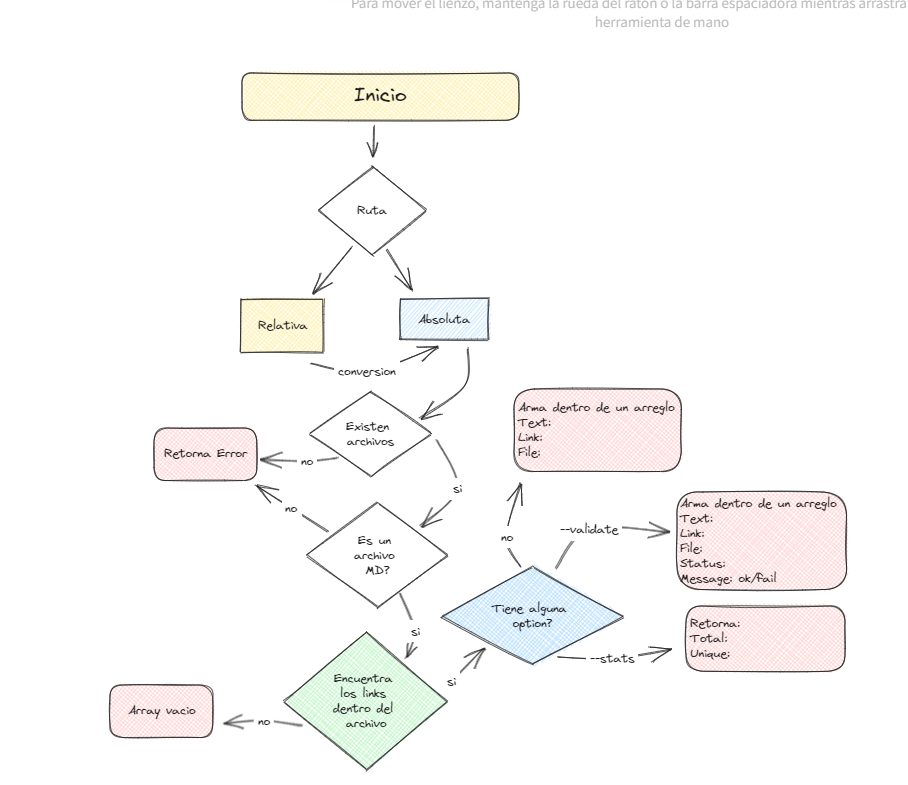

# MD Links

## Índice

* [1. Introduccion](#1-introduccion)
* [2. Caracteristicas del Proyecto](#2-caracteristicas-del-proyecto)
* [3. Instalacion](#3-instalación)
* [4. Uso](#4-uso)
* [5. Diagrama del proyecto](#5-diagrama-de-flujo-del-proyecto)
***

## 1. Introduccion

[Markdown](https://es.wikipedia.org/wiki/Markdown) es un lenguaje de marcado
ligero muy popular entre developers. Es usado en
muchísimas plataformas que manejan texto plano (GitHub, foros, blogs, etc.) y
es muy común encontrar varios archivos en ese formato en cualquier tipo de
repositorio (empezando por el tradicional `README.md`).

Estos archivos `Markdown` normalmente contienen _links_ (vínculos/ligas) que
muchas veces están rotos o ya no son válidos y eso perjudica mucho el valor de
la información que se quiere compartir.

Dentro de una comunidad de código abierto, nos han propuesto crear una
herramienta usando [Node.js](https://nodejs.org/), que lea y analice archivos
en formato `Markdown`, para verificar los links que contengan y reportar
algunas estadísticas.

## 2. Caracteristicas del proyecto
Este proyecto esta desarrollado con Node.js, JS y dependecias como TFunk. Se utilizo Fetch para validar los enlaces HTTP y sus estados.
Esta herrramienta permite analizar archivos Markdown en un directorio/subdirectorios donde puede encontrar enlaces contenidos en ello. En resumen: 

- Extrae información sobre los enlaces, como la URL, el texto del enlace y la ruta donde se encuentra.
- Busca dentro de directorios y sudirevtorios
- Obtener estadísticas sobre los enlaces encontrados, como el total de enlaces, enlaces únicos y enlaces rotos.
- Valida enlaces HTTP verificando su estado.


## 3. Instalación

Para instalar este paquete debe ejecutarse lo siguente en la terminal:

```
npm i FabyGranados/DEV009-md-links
```
## 4. Uso

Una vez que mdLinks esté instalado, puedes usarlo para analizar un archivo Markdown con el siguiente comando:

```
mdLinks path-file-o-directorio
```
Este comando mostrará en la terminal los enlaces encontrados en el archivo o directorio especificado.

### Opciones

mdLinks admite las siguientes opciones:

- --validate: Verifica el estado de los enlaces encontrados.
- --stats: Obtiene estadísticas sobre los enlaces encontrados.

### Ejemplos
- Uso --stats:


- Uso con --validate:


- Uso con ambos --validate --stats:


## 5. Diagrama de flujo del Proyecto
- Diagrama de flujo
  
